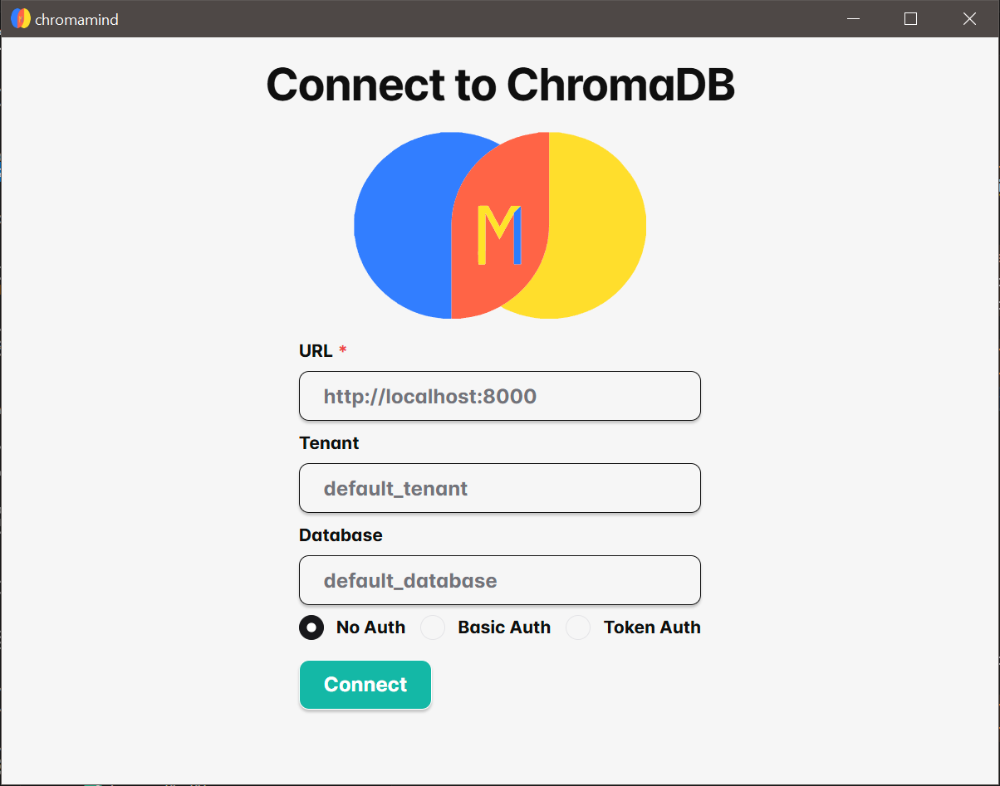
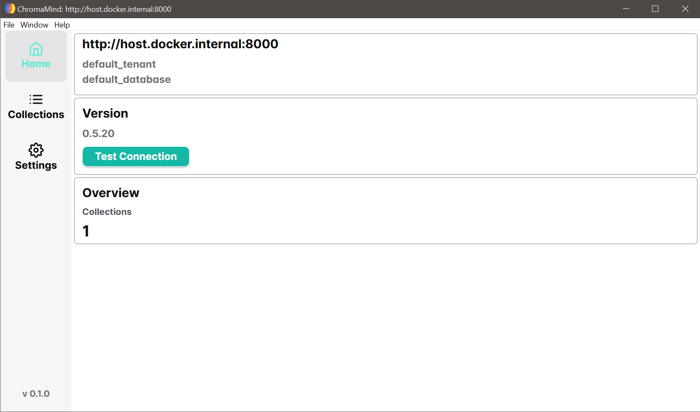

# ChromaMind

<p align="center">
    
</p>

**ChromaMind** is a desktop application built with [Rust](https://www.rust-lang.org/) and [Tauri](https://tauri.app/). It serves as a management tool for ChromaDB, providing a user-friendly interface for interacting with embeddings and collections. 


## Table of Contents
- [ChromaMind](#chromamind)
  - [Table of Contents](#table-of-contents)
  - [Features](#features)
  - [Quickstart](#quickstart)
  - [Development](#development)
    - [Prerequisites](#prerequisites)
    - [Build from Source](#build-from-source)
  - [Contribution](#contribution)
  - [License](#license)
  - [Acknowledgments](#acknowledgments)


 
## Features

- **Manage Collections:**
  - View collection info
  - Create new collections
  - Delete existing collections
- **View Embeddings:**
  - Browse and visualize embeddings within collections
- **Custom Theme:**
  - Personalize the application's appearance to suit your preferences

**Home View**
<p align="center">
    
</p>

**Overview**
<p align="center">
    
</p>

**Collections Tree**
<p align="center">
    
</p>

**Collection Overview**
<p align="center">
    
</p>

**Create Collction**
<p align="center">
    
</p>


## Quickstart
1. Start Chroma (if not already running):
```bash
docker run -d -v ./chroma-data:/data -p 8000:8000 chromadb/chroma
```
2. Start ChromaMind


## Development

### Prerequisites

- [Node.js](https://nodejs.org/) (minimum version: 20)
- [Rust](https://www.rust-lang.org/tools/install) (ensure you have the latest stable version installed)
- [Tauri prerequisites](https://v2.tauri.app/start/prerequisites/) based on your operating system

### Build from Source

1. Clone the repository:

   ```bash
   git clone https://github.com/probaku1234/chromamind.git
   cd ChromaMind
   ```

2. Install dependencies:

   ```bash
   npm i
   ```

3. Build and run:
   ```bash
   npm run tauri dev
   ```


## Contribution

We welcome contributions from the community! Please read our [Contributing Guidelines](https://github.com/probaku1234/chromamind/blob/main/CONTRIBUTING.md) before submitting pull requests.

For larger features or ideas, consider opening an issue to discuss them first.


## License

This project is licensed under the [MIT License](./LICENSE).


## Acknowledgments

- [Rust](https://www.rust-lang.org/) for providing a robust systems programming language
- [Tauri](https://tauri.app/) for making cross-platform desktop apps seamless
- [React](https://reactjs.org/) and [Chakra UI](https://chakra-ui.com/) for a clean and accessible user interface
- [ChromaDB](https://docs.trychroma.com/) for their innovative vector database technology
